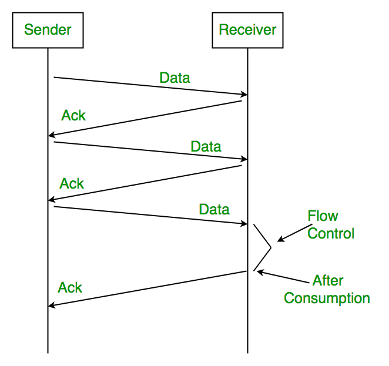

# Flow Control
### Data Communication & Networking (IT22504)

---

## What is Flow Control?
- Mechanism to prevent **fast sender** from overwhelming **slow receiver**.
- Ensures:
  - Receiver buffers don’t overflow.
  - Data delivery remains smooth.

---

## Key Goal
- Adjust sender’s transmission rate.
- Match it with receiver’s capacity.
- Fundamental to TCP reliability.

---

## Stop-and-Wait Protocol
- Sender transmits **one frame at a time**.
- Waits for ACK before sending the next.
- **Simple, but inefficient.**

---

<div style="display:flex;align-items:center;justify-content:center;height:65vh;margin:0;">
  
</div>

---


## Stop-and-Wait: Efficiency
Formula:
```

Efficiency = Tx_time / (Tx_time + RTT)

```
Where:
- Tx_time = frame_size / bandwidth
- RTT = Round-Trip Time


---

## Stop-and-Wait: Example
- Frame size = 1000 bytes → 8000 bits
- Bandwidth = 1 Mbps
- RTT = 40 ms

```

Tx_time = 8000 / 1,000,000 = 0.008 s
Efficiency = 0.008 / (0.008 + 0.04) ≈ 16.7%

```
---

## Sliding Window Protocol
- Sender transmits **multiple frames** before waiting for ACK.
- Receiver acknowledges cumulatively.
- Allows **pipelining** → higher throughput.

---

<div style="display:flex;align-items:center;justify-content:center;height:65vh;margin:0;">
  
</div>

---

## Sliding Window: Operation
- Sender variables: `send_base`, `next_seq_num`, `window_size`.
- Receiver variables: `rcv_base`, `rwnd`.

**Window slides** forward as ACKs are received.

---

## Go-Back-N (GBN)
- Receiver only accepts **in-order frames**.
- On loss → sender retransmits **from lost frame onward**.

---

<div style="display:flex;align-items:center;justify-content:center;height:65vh;margin:0;">
  
</div>

---

## Selective Repeat (SR)
- Receiver accepts **out-of-order frames**.
- Buffers them until missing ones arrive.
- Retransmits **only lost frames**.

**Constraint:** Sequence number space ≥ 2 × window size.

---

<div style="display:flex;align-items:center;justify-content:center;height:65vh;margin:0;">
  
</div>

---

## GBN vs SR
| Feature        | Go-Back-N              | Selective Repeat           |
|----------------|------------------------|----------------------------|
| Buffering      | Minimal                | Larger (out-of-order)      |
| Retransmission | From lost frame onward | Only lost frames           |
| Complexity     | Lower                  | Higher                     |
| Efficiency     | Lower                  | Higher                     |

---

## TCP Flow Control
- TCP uses **byte-oriented sliding window**.
- Receiver advertises **Receive Window (rwnd)**.
- Sender ensures:
```

Data_in_flight <= rwnd

```

---

## TCP Flow Control: Features
- **Zero Window:** Sender stops until buffer frees.
- **Persist Timer:** Sender probes until window reopens.
- **Window Scaling:** Overcomes 65 KB limit.
- **Delayed ACKs:** Reduce overhead.
- **SACK (Selective ACK):** Retransmit missing blocks only.

---

<div style="display:flex;align-items:center;justify-content:center;height:65vh;margin:0;">
  
</div>

---

## Recap
- Stop-and-Wait → simple, inefficient.
- Sliding Window → efficient, pipelined.
- GBN vs SR → tradeoff between simplicity & efficiency.
- TCP → advertised window, scaling, zero-window handling.

---

## நன்றி வணக்கம் 🙏